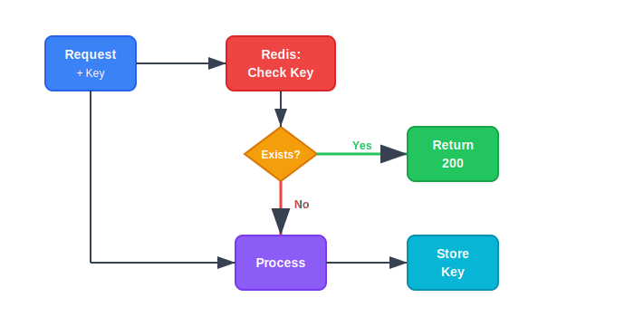
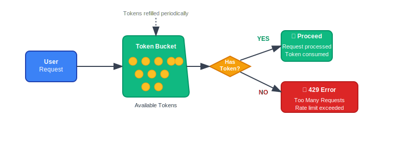

# Idempotent Payment API with Retry and Thundering Herd Protection

This project demonstrates an idempotent payment API implemented in Go. It handles retry logic using exponential backoff and protects against the thundering herd problem using token bucket rate limiting. Redis is used as a central store for idempotency keys and rate limiting.

---

## 📦 Architecture Overview

### 1. Payment Request Flow


* **User Client** initiates a payment request.
* **Payment API** receives the request and first checks Redis to see if the payment has already been processed using an `idempotency-key`.
* If found, it returns a cached response.
* If not found, it proceeds to process the payment and stores the result in Redis.

---

### 2. Idempotency Key Check Flow


* Incoming request first checks Redis for the `idempotency-key`.
* If the key exists, the API returns `200 OK` without re-processing.
* If not, the system processes the payment and stores the result with the key in Redis to ensure future retries are idempotent.

---

### 3. Retry Logic with Exponential Backoff


* Retry attempts double their delay after each failure (2s, 4s, 8s, etc.).
* Prevents system overload due to constant retries after transient failures.

---

### 4. Thundering Herd Problem & Token Bucket Solution


* A **Token Bucket** is used to throttle retries.
* Each retry consumes a token; if tokens are exhausted, the request is rejected or delayed.
* Tokens are replenished at a fixed rate.
* Protects backend from retry storms.

---

### 5. Client Simulator Logic


* Simulated Clients (A, B, C) all retry their requests due to a failure.
* Redis is used to coordinate retry attempts.
* Clients check for idempotency key before retrying, and are rate-limited.

---

## 🧰 Tech Stack

* **Go** — Backend logic
* **Redis** — Caching, idempotency, and rate limiting
* **Docker** — Containerization
* **Docker Compose** — Redis + App orchestration
* **Prometheus** — Metrics exposure
* **Structured Logging** — For observability

---

## 🚀 Running the Project

### Prerequisites

* Docker & Docker Compose

### Start Services

```bash
docker-compose -f docker-compose.yml up -d
```

---

## 🧪 Testing the Flow

Simulate requests using curl or the client simulator.

* Send same `idempotency-key` multiple times to verify no duplicate processing.
* Trigger failure and observe retry behavior.

---

## 🚀 Endpoints

| Endpoint   | Description                                |
| ---------- | ------------------------------------------ |
| `/pay`     | Accepts POST payments with idempotency key |
| `/metrics` | Prometheus metrics endpoint                |

--- 

## 📈 Prometheus Metrics
Metrics are exposed via `/metrics` using promhttp:

payment_requests_total: Counter for all requests

payment_requests_failed: Counter for failed requests

Ensure Prometheus is scraping this by verifying its job config.

---

## ✅ GitHub Actions CI/CD

* Automated build and test using GitHub Actions
* Docker build and push to registry (optional)

---

## 📂 Project Structure

```
.
├── .github/                            
│   ├── workflow
│       ├── ci.yml                      # CI action file for github
├── diagrams/                           # images for README.md
├── logs/                               # logs files created (gp-app.log)
├── monitoring/                         # monitoring configurations used by docker to setup
│   ├── dashboards
│       ├── Go-App-Metrics.json         # Dashboard panel setup 
│   ├── prometheus.yml
│   ├── loki-config.yaml
│   └── promtail-config.yaml
├── .dockerignore
├── .gitignore
├── docker-compose.monitoring.yml       # Prometheus, Grafana, promtail, Loki setup
├── docker-compose.yml                  # redis, App setup
├── Dockerfile
├── go.mod
├── go.sum
├── LICENSE
├── main.go                             # # Go app with payment handler
└── README.md
```

---

## 💡 Notes

- Use `http://localhost:8123/pay` to trigger test payments.

- Use `simulateClients()` in Go to generate load automatically.

- Metrics are accessible at: `http://localhost:8123/metrics`.

---

## 📥 Sample Curl Request

```

curl -X POST http://localhost:8123/pay \   
-H "Content-Type: application/json" \   
-d '{     
        "user_id": "user123",     
        "amount": 50.5,     
        "idempotency_key": "key-abc-123"   
}'

```

---

# Code Explanation: Idempotent Payment API in Go

This Go project implements a resilient and idempotent payment API with multiple advanced features. Below is a breakdown of the key parts of the code, now including diagrams and a walkthrough of the client simulator logic.

---

## 🔧 Core Components

### 1. **PaymentRequest Struct**

```go
type PaymentRequest struct {
    UserID         string  `json:"user_id"`
    Amount         float64 `json:"amount"`
    IdempotencyKey string  `json:"idempotency_key"`
}
```

Holds the payload received in the `/pay` request. The `IdempotencyKey` ensures the operation is processed only once.

🖼️ **Diagram: PaymentRequest Flow**


🌐 HTTP Server

```go
http.HandleFunc("/pay", paymentHandler)
http.Handle("/metrics", promhttp.Handler())
```

- `/pay`: Payment endpoint
  
- `/metrics`: Prometheus endpoint to scrape application metrics
  

---

## 🧠 Idempotency with Redis

```go
key := "payment:idempotency:" + req.IdempotencyKey
exists, err := rdb.Exists(ctx, key).Result()
```

- Checks Redis to see if the request with the same idempotency key was already processed.
  
- If yes, skips processing and returns early.
  
- If no, processes the request and stores the key to prevent reprocessing.
  

🖼️ **Diagram: Idempotency Check**



## 💣 Simulated Server Failures

```go
if rand.Intn(10) < 3 {
    http.Error(w, "Internal Server Error", http.StatusInternalServerError)
    return
}
```

Randomly returns a `500` error 30% of the time to simulate transient server errors.

---

## 🔁 Retry with Exponential Backoff

```go
delay := 500 * time.Millisecond
for i := 0; i < maxRetries; i++ {
    ...
    time.Sleep(delay)
    delay *= 2
}
```

- If a request fails due to server or network error, retry with increasing wait time: 500ms, 1s, 2s, etc.

🖼️ **Diagram: Exponential Backoff


---

## 🔒 Rate Limiting with Token Bucket

```go
rateLimiterMu.Lock()
if tokens <= 0 {
    http.Error(w, "Too many requests", http.StatusTooManyRequests)
    return
}
tokens--
rateLimiterMu.Unlock()
```

- Uses a shared token count to prevent too many users from accessing the service at once.
  
- Tokens are replenished periodically in a separate goroutine.
  

🖼️ **Diagram: Token Bucket Rate Limiting



---

## 🤖 Client Simulator

### Function

```go
func simulateClients() {
    for i := 0; i < 5; i++ {
        go func(i int) {
            retryWithExponentialBackoff("http://localhost:8123/pay", request)
        }(i)
    }
}
```

- Simulates multiple clients sending requests concurrently.
  
- Each uses its own idempotency key.
  
- Retries on failure using exponential backoff.
  

### Retry Logic

```go
func retryWithExponentialBackoff(url string, req PaymentRequest) {
    delay := time.Millisecond * 500
    for i := 0; i < 5; i++ {
        resp, err := http.Post(...)
        if err == nil && resp.StatusCode == http.StatusOK {
            break
        }
        time.Sleep(delay)
        delay *= 2
    }
}
```

- Sends the request.
  
- If it fails or receives a `500`, it retries after increasing delay.
  
- Stops retrying after 5 attempts.
  

🖼️ **Diagram: Client Simulator Flow


---

## 📈 Metrics with Prometheus

```go
requestsTotal  = prometheus.NewCounter(...)
requestsFailed = prometheus.NewCounter(...)
prometheus.MustRegister(requestsTotal, requestsFailed)
```

- Tracks successful and failed requests.
  
- Exposed on `/metrics` for Prometheus scraping.
  

---

## 🧾 Structured Logging

```
log.Info().Str("key", req.IdempotencyKey).Msg("Payment processed")
```

- Uses `zerolog` for fast and consistent logging in structured JSON format.

---

### Start Monitoring Services

```
docker-compose.monitoring up --build
```

---
---

## 🧭 Step-by-Step: Open Grafana & View Logs with Loki

### ✅ 1. **Open Grafana in Your Browser**

If you're using Docker Compose (from the `monitoring` setup), Grafana should be available at:

```
http://localhost:3000
```

If you're using Docker on Linux and not `localhost`, replace it with your Docker host's IP.

---

### ✅ 2. **Login to Grafana**

Default login credentials:

- **Username:** `admin`
  
- **Password:** `admin`
  

You’ll be asked to change the password after first login.

---

### ✅ 3. Add Data Sources if Not Configured

#### If you haven’t connected Loki yet:

1. On the left sidebar, click ⚙️ **Connections** → **Data Sources**
  
2. Click **“Add data source”**
  
3. You should see **Loki** in the list (it may already be auto-configured if you're using provisioning)
  
4. Click **Loki**
  
5. Enter connectionUrl:
  
  - **Loki**
    
    - URL: `http://loki:3100`
6. Click **“Save & Test”** after each.
  
  - If successful, Loki is now usable!

#### If you haven’t connected Prometheus yet:

1. On the left sidebar, click ⚙️ **Connections** → **Data Sources**
  
2. Click **“Add data source”**
  
3. You should see **Prometheus** in the list (it may already be auto-configured if you're using provisioning)
  
4. Click **Prometheus**
  
5. Enter datasource Url:
  
  - **Prometheus**
    
    - URL: `http://prometheus:9090`
6. Click **“Save & Test”** after each.
  
  - If successful, Loki is now usable!
 

---

### ✅ 5. Import a Dashboard in Grafana

#### **Access the Import Dashboard Menu**

- In the **left-hand sidebar**, click the **“+” icon** (Create)
  
- Select **“Import dashboard”**
  
- Copy paste the JSON or upload the /monitoring/dashboards/Go-App-Metrics.json file
  
- Click **"Import"**
  
- Upon successful import, **Dashboard** will be displayed or you can visit dashboard by cliking **Dashboard** from **left-hand sidebar**
  

---

### ✅ 6. **Explore Your Logs**

1. On the left sidebar, click the **compass icon** 🧭 → **Explore**
  
2. In the dropdown on top left, choose **Loki** as the data source
  
3. In the **query bar**, enter:
  

```
{job="go-app"}
```

This will show all log lines collected from your Go app!

4. You can click on each log line to see structured JSON, e.g.:

```
{
    "level": "info",
    "key": "key-3",
    "message": "Retry succeeded"
}
```

---

# Stop Services

```
docker-compose -f docker-compose.yml down

docker-compose -f docker-compose.monitoring.yml down
```

---

## 👨‍💻 Author

#Enjoy Coding (Began BALAKRISHNAN) ❤️

---


